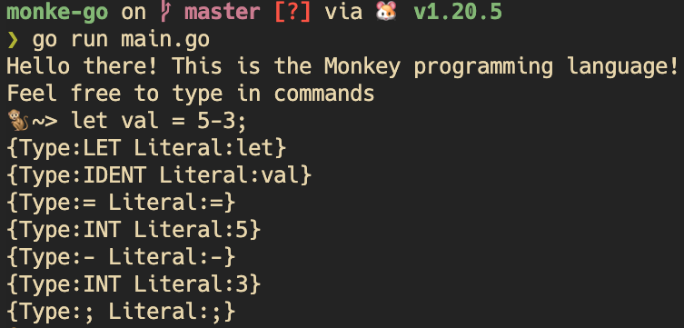

# Monke-go 🐒

> Learning how interpreters work going through [Thorsten Ball - Writing an Interpreter in Go](https://interpreterbook.com/).

# Features

List of language features:

- C-like syntax
- variable bindings
- integers and booleans
- arithmetic expressions
- built-in functions
- first-class and higher-order functions
- closures
- recursion
- a string data structure
- an array data structure
- a hash data structure

Types:

- integer
- boolean
- string
- array
- hash
- function

Binding example:

```js
let age = 1;
let name = "Monke";
let result = 10 * (20/2);
let arr = [1, 2, 3];
let dev = {"name": "Camilo", "age": 30}
let adder = fn(a, b) {a + b};
```

Accessing elements:

```js
let v = arr[0];
dev["name"]
adder(3, 5);
```

Recursion:

```js
let fibonacci = fn(x) {
  if (x == 0) {
    0
  } else {
    if (x == 1) {
      1
    } else {
      fibonacci(x - 1) + fibonacci(x - 2);
    }
  }
};
```

HOF:

```js
let twice = fn(f, x) {
  return f(f(x));
};

let addTwo = fn(x) {
  return x + 2;
};

twice(addTwo, 2);
```

# Monke Elements

- Lexer: called "lexical analysis" or "lexing", source code => tokens. It may also attach filename, column and line numbers.
- Parser: tokens => Abstract Syntax Tree
- Abstract Syntax Tree (AST)
- Internal object system
- Evaluator

Source code:

```js
lex x = 5 + 5;
```

Tokens:

```js
[
  LET,
  IDENTIFIER("x"),
  EQUAL_SIGN,
  INTEGER(5),
  PLUS_SIGN,
  INTEGER(5),
  SEMICOLON
]
```

# 1st Iteration - Lexer

Starting with a small language subset, enough to parse the following program:

```js
let five = 5;
let ten = 10;

let add = fn(x, y) {
  x + y;
};

let result = add(five, ten);
```

The tokens:

```js
[
  LET,
  FUNCTION,
  EQUAL,
  COMMA,
  SEMICOLON,
  PLUS,
  LBRACE,
  RBRACE,
  LPAREN,
  RPAREN,
  INT(5),
  INT(10),
  IDENT("add"),
  IDENT("five"),
  IDENT("result"),
  IDENT("ten"),
  IDENT("x"),
  IDENT("y"),
]
```

Then, the lexer should be able to identify single (`+`, `{`, etc.), double (`==` or `!=`) or multiple (`let`, `fn`, `return`) characters and return a `Token`.

Result:



# Improvements

- `TokenType` could be replaced by int or byte to increase performance and decrease memory usage
- Add filename and line number to `Token` to increase error handling and debuggability
- Use [`io.Reader`](https://pkg.go.dev/io#Reader) to lexer
- Support for UNICODE characters and emojis
- Support for floats, hexa, octal and binary numbers

